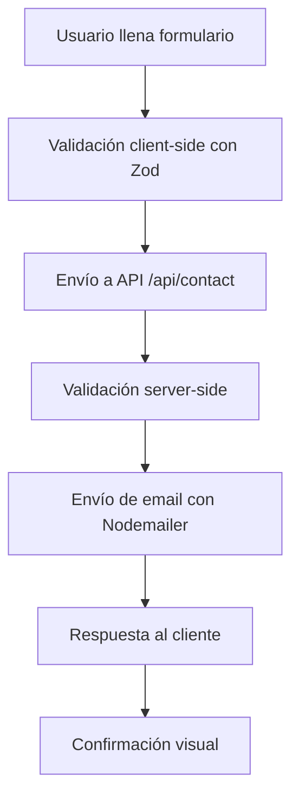
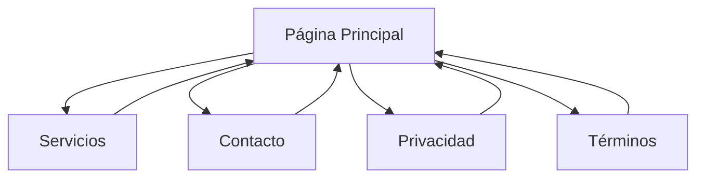

# Arquitectura del Proyecto - Gestión de Cobranzas SAS

## 🏗️ Visión General

Este proyecto es una aplicación web moderna construida con Next.js 15, diseñada para ser escalable, mantenible y optimizada para SEO. Utiliza el App Router de Next.js para una estructura de rutas moderna y eficiente.

## 📁 Estructura del Proyecto

```
gestiondecobranzas/
├── src/
│   ├── app/                     # App Router de Next.js
│   │   ├── api/                 # API Routes
│   │   │   └── contact/
│   │   │       └── route.ts     # Endpoint para formulario de contacto
│   │   ├── contacto/
│   │   │   └── page.tsx         # Página de contacto
│   │   ├── servicios/
│   │   │   └── page.tsx         # Página de servicios
│   │   ├── privacidad/
│   │   │   └── page.tsx         # Política de privacidad
│   │   ├── terminos/
│   │   │   └── page.tsx         # Términos y condiciones
│   │   ├── globals.css          # Estilos globales
│   │   ├── layout.tsx           # Layout raíz con metadata
│   │   └── page.tsx             # Página de inicio
│   └── components/
│       └── ContactForm.tsx      # Formulario de contacto reutilizable
├── public/                      # Assets estáticos
├── .env.example                 # Template de variables de entorno
├── next.config.ts               # Configuración de Next.js
├── tailwind.config.ts           # Configuración de Tailwind CSS
├── tsconfig.json                # Configuración de TypeScript
└── package.json                 # Dependencias y scripts
```

## 🛠️ Stack Tecnológico

### Frontend
- **Next.js 15**: Framework React con App Router
- **React 19**: Biblioteca de UI con las últimas características
- **TypeScript**: Tipado estático para mayor robustez
- **Tailwind CSS**: Framework de utilidades CSS
- **Framer Motion**: Animaciones fluidas y transiciones

### Formularios y Validación
- **React Hook Form**: Manejo eficiente de formularios
- **Zod**: Validación de esquemas con TypeScript
- **@hookform/resolvers**: Integración entre RHF y Zod

### Email y Comunicación
- **Nodemailer**: Envío de emails desde el servidor
- **SMTP**: Configuración para Google Workspace con TLS
- **Dominio unificado**: Todos los emails migrados a @gestiondecobranzas.com
- **Email principal**: adm@gestiondecobranzas.com para contacto y administración
- **Templates**: HTML responsivo para emails
- **Validación**: Doble validación (cliente y servidor)
- **Fallback**: Logs en desarrollo, emails reales en producción
- **Seguridad**: Configuración TLS habilitada para mayor seguridad

### Iconografía y UI
- **Lucide React**: Iconos modernos y consistentes

## 🎨 Decisiones de Diseño

### UI/UX
- **Diseño moderno**: Gradientes, glassmorphism, animaciones suaves
- **Responsive first**: Mobile-first approach con breakpoints optimizados
- **Accesibilidad**: Contraste adecuado, navegación por teclado
- **Performance**: Lazy loading, optimización de imágenes
- **Branding consistente**: Logo SVG oficial integrado en header
- **Footer unificado**: Componente reutilizable para consistencia visual

### Arquitectura de Componentes
- **Componentes reutilizables**: Footer centralizado para toda la app
- **Separación de responsabilidades**: Lógica de negocio separada de UI
- **Tipado estricto**: TypeScript en todos los componentes
- **Props interface**: Interfaces bien definidas para cada componente

### Sistema de Colores
```css
/* Paleta principal */
--primary-blue: #1e40af;
--secondary-blue: #3b82f6;
--accent-green: #10b981;
--dark-bg: #0f172a;
--card-bg: #1e293b;
```

### Tipografía
- **Font Principal**: Geist Sans (variable)
- **Font Monospace**: Geist Mono (para código)
- **Jerarquía**: Sistema escalable con Tailwind

### Responsive Design
- **Mobile First**: Diseño optimizado para móviles
- **Breakpoints**: sm (640px), md (768px), lg (1024px), xl (1280px)
- **Grid System**: CSS Grid y Flexbox

## 🔄 Flujo de Datos

### Formulario de Contacto


### Navegación


## 🎯 Patrones de Desarrollo

### Componentes
- **Functional Components**: Uso exclusivo de componentes funcionales
- **Hooks**: useState, useEffect, custom hooks cuando sea necesario
- **Props Interface**: Tipado estricto con TypeScript

#### ContactForm
- **Ubicación**: `src/components/ContactForm.tsx`
- **Propósito**: Formulario de contacto con validaciones
- **Dependencias**: React Hook Form, Zod, Framer Motion
- **Estado**: Maneja loading, success, error
- **Validaciones**: Nombre, email, empresa, mensaje, volumen

#### Footer (Nuevo)
- **Ubicación**: `src/components/Footer.tsx`
- **Propósito**: Footer unificado para toda la aplicación
- **Características**:
  - Diseño moderno con gradientes y efectos de vidrio
  - Información de contacto centralizada
  - Enlaces a redes sociales (LinkedIn, Twitter, Instagram)
  - Secciones organizadas: Servicios, Soporte, Legal
  - Responsive design optimizado
  - Efectos hover y transiciones suaves
- **Reutilización**: Implementado en todas las páginas principales

### Estado
- **Local State**: React Hook Form para formularios
- **Server State**: API Routes de Next.js
- **No Global State**: Proyecto simple sin necesidad de Redux/Zustand

### Estilos
- **Utility-First**: Tailwind CSS como metodología principal
- **Component Scoped**: Estilos específicos cuando sea necesario
- **Responsive**: Mobile-first approach

## 🔒 Seguridad

### Validación
- **Client-side**: Zod schemas para UX inmediata
- **Server-side**: Validación duplicada en API routes
- **Sanitización**: Limpieza de inputs antes del procesamiento

### Variables de Entorno
- **Separación**: Credenciales fuera del código
- **Tipado**: Variables de entorno tipadas
- **Ejemplo**: .env.example para documentación

### Headers de Seguridad
- **CSP**: Content Security Policy (recomendado para producción)
- **HSTS**: HTTP Strict Transport Security
- **X-Frame-Options**: Prevención de clickjacking

## 📊 Rendimiento

### Optimizaciones de Next.js
- **Static Generation**: Páginas estáticas cuando es posible
- **Image Optimization**: Componente Image de Next.js
- **Bundle Splitting**: Automático con Next.js
- **Tree Shaking**: Eliminación de código no utilizado

### Métricas Core Web Vitals
- **LCP**: Largest Contentful Paint < 2.5s
- **FID**: First Input Delay < 100ms
- **CLS**: Cumulative Layout Shift < 0.1

### Estrategias de Caché
- **Static Assets**: Cache-Control headers
- **API Responses**: Caché apropiado para datos
- **CDN**: Distribución global de contenido

## 🧪 Testing (Recomendaciones)

### Unit Testing
```bash
# Configuración recomendada
npm install --save-dev jest @testing-library/react @testing-library/jest-dom
```

### E2E Testing
```bash
# Playwright para testing end-to-end
npm install --save-dev @playwright/test
```

### Accessibility Testing
```bash
# axe-core para testing de accesibilidad
npm install --save-dev @axe-core/react
```

## 🔄 CI/CD Pipeline

### GitHub Actions (Recomendado)
```yaml
name: CI/CD
on:
  push:
    branches: [main]
  pull_request:
    branches: [main]

jobs:
  test:
    runs-on: ubuntu-latest
    steps:
      - uses: actions/checkout@v3
      - uses: actions/setup-node@v3
      - run: npm ci
      - run: npm run lint
      - run: npm run build
      - run: npm run test
```

## 📈 Escalabilidad

### Consideraciones Futuras
- **Database**: Prisma + PostgreSQL para datos persistentes
- **Authentication**: NextAuth.js para autenticación
- **CMS**: Strapi o Sanity para gestión de contenido
- **Analytics**: Google Analytics 4 + Vercel Analytics
- **Monitoring**: Sentry para error tracking

### Microservicios
- **API Gateway**: Para múltiples servicios
- **Serverless Functions**: Vercel Functions o AWS Lambda
- **CDN**: CloudFlare o AWS CloudFront

## 🔧 Herramientas de Desarrollo

### Code Quality
- **ESLint**: Linting de JavaScript/TypeScript
- **Prettier**: Formateo de código
- **Husky**: Git hooks para calidad
- **lint-staged**: Linting en archivos staged

### Development
- **VS Code**: Editor recomendado
- **Extensions**: ES7+ React/Redux/React-Native snippets, Tailwind CSS IntelliSense
- **Debugging**: React Developer Tools, Next.js debugging

## 📚 Documentación

### Archivos de Documentación
- **README.md**: Información general y setup
- **DEPLOYMENT.md**: Guía de despliegue
- **ARCHITECTURE.md**: Este archivo
- **CHANGELOG.md**: Historial de cambios

### Comentarios en Código
- **JSDoc**: Para funciones complejas
- **Inline Comments**: Para lógica no obvia
- **Type Annotations**: TypeScript como documentación

---

**Última actualización:** Enero 2025  
**Versión:** 1.0.0  
**Mantenido por:** Equipo de Desarrollo Gestión de Cobranzas SAS